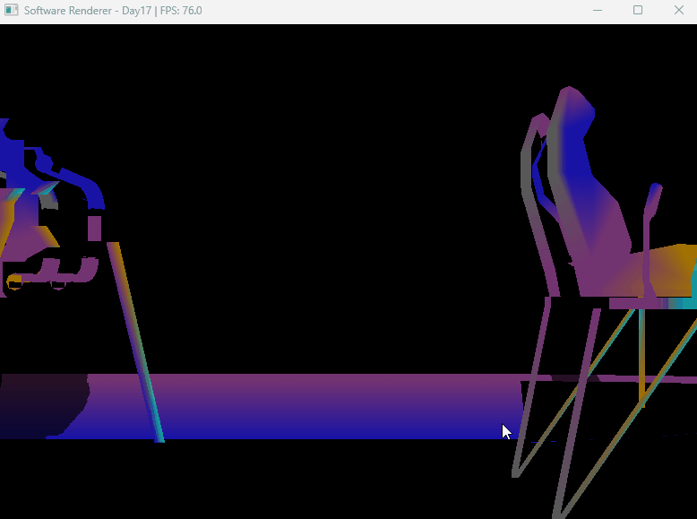

# Software Rasterizer

> C++ / Windows API로 구현한 소프트웨어 래스터라이저

## 개요

GPU 없이 CPU만으로 3D 렌더링 파이프라인을 직접 구현한 프로젝트입니다.  
렌더링 파이프라인의 동작 원리를 깊이 이해하기 위해 제작했습니다.

## 구현 기능

| 기능 | 설명 |
|------|------|
| Framebuffer / DIBSection | CPU 렌더링 결과를 Windows 화면에 출력 |
| Bresenham 라인 알고리즘 | 정수 연산 기반 직선 렌더링 |
| 삼각형 래스터라이제이션 | 바리센트릭 좌표 기반 픽셀 fill |
| MVP 행렬 변환 | Model / View / Projection 행렬 직접 구현 |
| Z-buffer | 깊이 기반 픽셀 가시성 판별 |
| Flat / Gouraud Shading | 면 단위 / 버텍스 단위 조명 보간 |
| OBJ 로더 | Wavefront OBJ 포맷 파싱 |
| Back-face Culling | 후면 삼각형 제거 |
| Frustum Culling | 화면 밖 삼각형 제거 |
| 텍스처 매핑 | BMP 텍스처 UV 매핑 |
| SIMD 최적화 | SSE2 4-wide 픽셀 병렬 처리 |
| 멀티스레드 래스터라이제이션 | std::thread 8코어 타일 분할 처리 |
| Shadow Mapping | 광원 시점 깊이 버퍼 기반 그림자 |
| Normal Mapping | 법선 벡터 텍스처 기반 조명 디테일 |
| ECS 구조 | Entity-Component-System 씬 관리 |

## 성능 개선

| 단계 | 방법 | FPS |
|------|------|-----|
| 초기 | SetPixel | 0.3 |
| 최적화 1 | DIBSection 직접 쓰기 | 32 |
| 최적화 2 | SIMD + Frustum Culling | 32+ |
| 최적화 3 | 멀티스레드 (8코어) + Sleep 제거 | 726 |

## 빌드 환경

- Visual Studio 2022
- C++17
- Windows API (Win32)
- AVX2 SIMD

## 빌드 방법

1. `SoftwareRenderer.sln` 열기
2. 구성: `Release / x64`
3. 빌드 실행