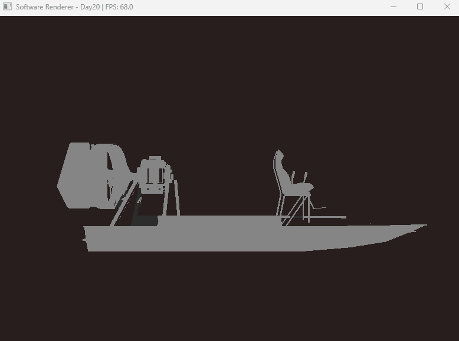

# Software Rasterizer

> C++ / Windows API로 구현한 소프트웨어 래스터라이저

## 개요

GPU 없이 CPU만으로 3D 렌더링 파이프라인을 직접 구현한 프로젝트입니다.

Framebuffer 설정부터 멀티 텍스처 매핑, Shadow Mapping, 멀티스레드 최적화까지
렌더링 파이프라인의 모든 단계를 직접 구현하며 동작 원리를 깊이 이해했습니다.

## 구현 기능

| 기능 | 설명 |
|------|------|
| Framebuffer / DIBSection | CPU 렌더링 결과를 Windows 화면에 출력 |
| Bresenham 라인 알고리즘 | 정수 연산 기반 직선 렌더링 |
| 삼각형 래스터라이제이션 | 바리센트릭 좌표 기반 픽셀 fill |
| MVP 행렬 변환 | Model / View / Projection 행렬 직접 구현 |
| Z-buffer | 깊이 기반 픽셀 가시성 판별 |
| Flat / Gouraud Shading | 면 단위 / 버텍스 단위 조명 보간 |
| OBJ 로더 | Wavefront OBJ 포맷 파싱 (usemtl 머티리얼 지원) |
| Back-face Culling | 후면 삼각형 제거 |
| Frustum Culling | 화면 밖 삼각형 제거 |
| PNG 텍스처 매핑 | stb_image 기반 PNG 로딩 + UV 매핑 |
| 멀티 머티리얼 시스템 | usemtl 파싱 → 삼각형별 텍스처 분기 |
| 람버트 조명 | 페이스 노멀 기반 디퓨즈 조명 |
| SIMD 최적화 | SSE2 4-wide 픽셀 병렬 처리 |
| 멀티스레드 래스터라이제이션 | std::thread 16코어 타일 분할 처리 |
| Shadow Mapping | 광원 시점 깊이 버퍼 기반 2-pass 그림자 (구현 완료, 성능 트레이드오프로 비활성화) |
| PBR | Cook-Torrance BRDF (GGX, Fresnel, Smith) + Reinhard Tone Mapping (구현 완료, 람버트로 대체) |
| ECS 구조 | Entity-Component-System 씬 관리 |

## 성능 개선

| 단계 | 방법 | FPS |
|------|------|-----|
| 초기 | SetPixel API | 0.3 |
| 최적화 1 | DIBSection 직접 쓰기 | 32 |
| 최적화 2 | SIMD (SSE2) + Frustum Culling | 32+ |
| 최적화 3 | 멀티스레드 16코어 타일 분할 | 300+ |

> SetPixel 대비 **1,000배 이상** 성능 향상

## 렌더링 파이프라인

OBJ 로드 (머티리얼 파싱) → MVP 변환 → Back-face / Frustum Culling
→ 멀티스레드 16코어 래스터라이제이션
└─ 바리센트릭 좌표 → Z-buffer → 머티리얼별 텍스처 샘플링
└─ 람버트 조명 → 픽셀 출력

## 빌드 환경

- Visual Studio 2022
- C++17
- Windows API (Win32)
- AVX2 / SSE2 SIMD

## 빌드 방법

1. `SoftwareRenderer.sln` 열기
2. 구성: `Release / x64`
3. 빌드 실행

## 에셋 출처

| 에셋 | 출처 | 라이선스 |
|------|------|------|
| Sofa OBJ | Amir Hussein Gholizade | [CC Attribution](https://sketchfab.com/3d-models/sofa-obj-10583d1e081345fa95536ad71e6f4871) |
| Case with money | tasha.kosaykina | [CC Attribution](https://sketchfab.com/3d-models/case-with-money-low-poly-b6ae7582e0bb45bc950b0ea177ae8eed) |
| Easter Eggs | [Render at Night - Sketchfab](https://sketchfab.com/3d-models/easter-eggs-ac0b0892e538449da59f2f9beb66f855) | CC Attribution |